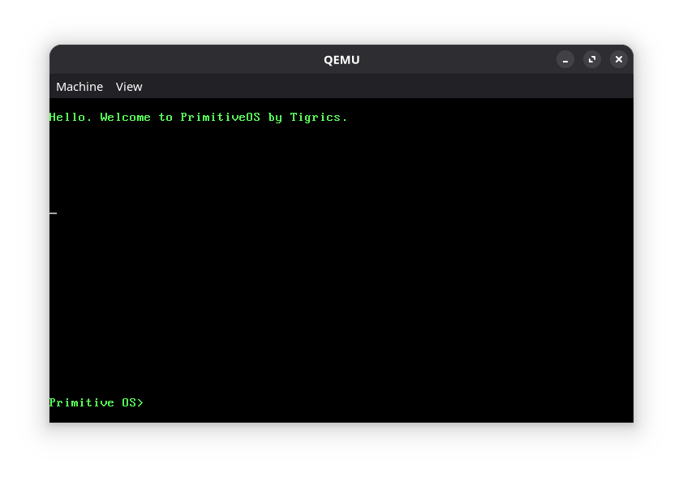
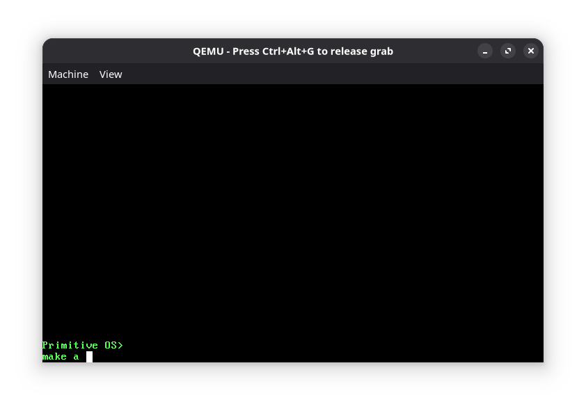
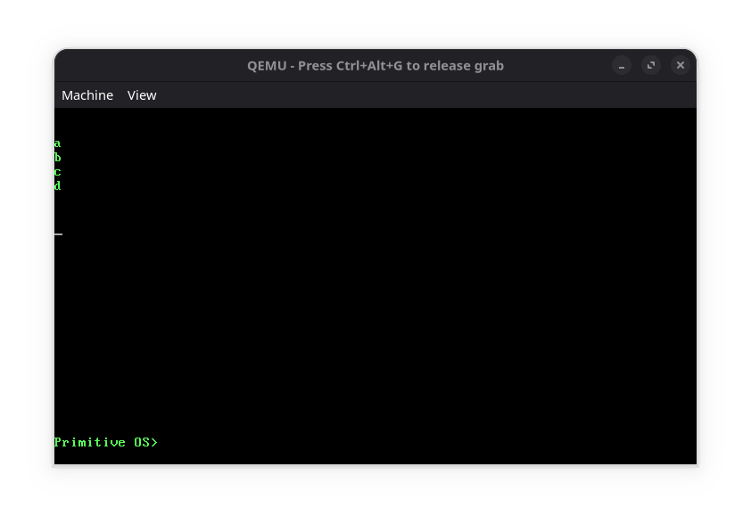

# Primitive OS 🐅

**Operation system created from scratch in C by 14-year-old developer**

> From "Hello World" to custom kernel with file system in just few days

## 🚀 Features
- **Custom kernel** with bootloader
- **In-memory file system** (CRMD: Create, Read, Modify, Delete)  
- **Command interpreter** with 12+ commands
- **Text editor** built-in
- **Power management** (shutdown/reboot)
- **Keyboard driver** via port I/O
- **VirtualBox compatible**

## 🎯 Quick Start
1. Download ISO from [Releases]
2. Create VM (Type: Other, Version: Other/Unknown)
3. Mount ISO and boot
4. Type `help` for commands list

## 📸 Screenshots

 

## 🛠️ Commands
* hello - Welcome message
* help - Show all commands
* clear - Clear console
* write - Print text
* make - Create file
* dlt - Delete file
* list - Show files
* te - Text editor
* shutdown - Power off
* reload - Reboot
## 🧩 Architecture
- **Flat file system** - simplicity over complexity
- **Short commands** - efficiency matters  
- **RAM disk** - fast and simple
- **No external dependencies** - pure C and assembly

## 📖 Story
Started as "Hello World", evolved into full OS:
- Day 1: Bootloader and kernel basics
- Day 2: Keyboard driver and shell
- Day 3: File system and commands
- Day 4: System utilities and games

## ❗ Disclaimer
**For educational purposes only!**  
Don't install on real hardware. Use VirtualBox/VMware.

---

*"The one who turns templates into working systems"* - Tigrics, 14 y.o.
